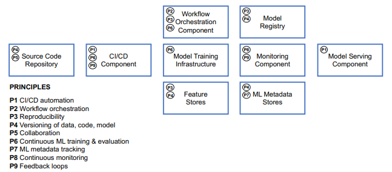
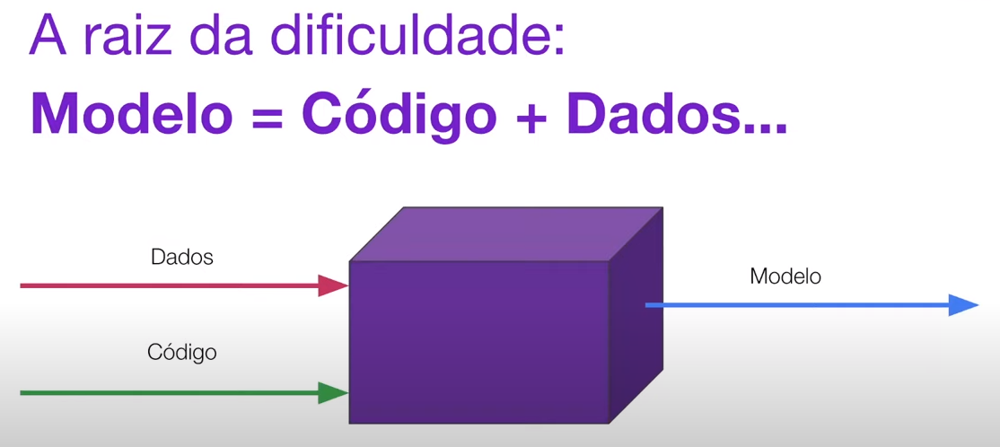

# Machine Learning Ops

Eh uma area sendo estruturada relativamente recentemente se apoiando nas experiencias geradas por implementacoes da filosofia devOps em codigos, aproximando os resultados observados para o contexto de Machine Learning.

A ideia principal eh de que fazendo isso os beneficios gerados pela DevOps em software engineering se replique no campo de ML como criacoes mais "production-ready", modelos que sejam pautados em CI/CD e que portanto sejam mais faceis de mmanipular com muita frequencia retirando dores comuns durante o processo de:

- **monitoramento > retreinamento > redeploy**

A metodologia MLOps se apoia em alguns principios e seus componentes tecnicos, para que possa ter uma implementacao que funcione.

A imagem acima detalha bem seus principios e os componentes tecnicos disponiveis atualmente que possibilitam a execucao correta desses principios.

Os principios em que MLOps se apoia:

<ol>
 <li>CI/CD automation:</li>
    <ul>
        <li>A automacao CI/CD oferece entrega continua e portanto eh o primeiro pilar da MLOps, cujo o qual sem ele, nao seria possivel corrigir rapidamente os erros, perceber rapidamente o que foram acertos. De um modo geral uma melhoria necessaria no campo de monitoramento.</li>
    </ul>
    <li>Workflows Orquestrados:</li>
    <ul>
        <li>Seus workflows precisam estar organizados de acordo com a ordem de tarefas estabelecida pelas DAGs do seu pipeline.</li>
    </ul>
    <li>Reprodutibilidade:</li>
    <ul>
        <li>Eh a habilidade de reproduzir um experimento ML e obter exatamente os mesmos resultados, de forma rapida e eficiente. </li>
    </ul>
    <li>Versionamento:</li>
    <ul>
        <li>Com versionamento eh possivel <strong>rastrear</strong> o historico de versao do modelo associando isso com quais eram os dados naquele momento do experimento.</li>
        
    </ul>
    <li>Colaboracao:</li>
    <ul>
        <li>Assim como no mundo do software, a colaboracao possibilita a transmissao muito mais eficiente e moderna de conhecimento das descobertas.</li>
    </ul>
    <li>Treino e avaliacao continua do Modelo:</li>
    <ul>
        <li>Considerando que a entrada de dados eh continua e portanto sempre tem novas variaveis, se faz cada vez mais importante a necessidade de reavaliacao e de novos treinos do modelo, com os outros principios bem estabelecidos, fica mais facil realizar essas atividades com mais frequencia, porque faz com que o cientista se concentre apenas nisso (evitando os problemas de deploy e ja instaurando a estrutura de rastreamento do momento do modelo, bem como seus dados associados.</li>
    </ul>
    <li>Log e rastreio dos metadados do modelo:</li>
    <ul>
        <li>A cada treino eh possivel gerar logs e rastrear os dados gerados em cada task do seu workflow, focando novamente na rastreabilidade do modelo e seus dados associados, o que faz com que cada treino possa ser melhor preparado e portanto sendo ainda mais rapido.</li>
    </ul>
    <li>Monitoramento continuo:</li>
    <ul>
        <li>A grande capacidade de rastreio e associacao entre codigo + dataset nos experimentos permite que com maior frequencia os resultados possam ser monitorados e potenciais erros possam ser percebidos, ou mudancas que signifiquem impacto na qualidade do produto.</li>
    </ul>
    <li>Feedback recorrente:</li>
    <ul>
        <li>O aumento da frequencia destacada em todos os outros principios fazem com que novos insights sejam gerados a partir da quantidade de dados sobre o modelo que eh gerado a cada nova rotina de treino.</li>
    </ul>

</ol>
